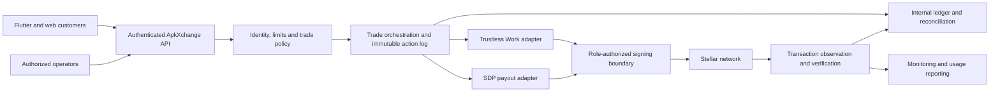

# ApkXchange Trade Rail — proposed Stellar architecture

Version: 3 October 2026. Technical review draft for the SCF Integration Track. This describes planned integration work; it is not a deployed Stellar implementation. Signing arrangements and component compatibility require CTO validation before this document is used as the final submission architecture.

## Product boundary

ApkXchange will integrate Stellar USDC settlement, Trustless Work escrow and the Stellar Disbursement Platform (SDP) into its existing gift-card, wallet and planned P2P experiences. The initial funded rail is USDC on Stellar. Other assets, swaps and fiat corridors require separate technical and commercial validation and are outside this initial commitment.

Existing Flutter and web interfaces, identity checks, trade workflows and the internal ledger provide the application foundation. The existing application foundation includes wallet holds, ledger postings, trade-state validation and governed dispute operations. These controls must be adapted and tested against an external onchain escrow; an internal ledger hold alone will never be displayed as a funded Trustless Work escrow.

GHS collection or payout remains a separate authorized payment flow. SDP sends Stellar assets to supported recipients; it is not a GHS/RMB conversion service. No new token is proposed.

## Planned customer and authorization workflow

**Stellar disbursements:** ApkXchange plans to make Stellar USDC payouts available to all users who meet the applicable verification requirements and complete supported wallet onboarding. Customers can select this settlement option for eligible transactions, with confirmed payment status reflected in their account. Broad customer availability does not imply compatibility with every external wallet; the supported recipient route will be validated during integration.

**Transaction authorization:** ApkXchange's backend will validate the customer, recipient, asset and amount before authorizing a transaction through a protected signing service. Signing credentials will remain outside the mobile and web applications. The team will validate the selected signing implementation during integration, including its Stellar transaction and Soroban authorization support.

**P2P escrow:** USDC will be held in a Trustless Work escrow while the agreed trade conditions are fulfilled. Release will require the designated participant's approval. Disputed trades will follow a documented evidence-review process, with resolution performed through authorized contract roles. Ledger settlement will follow confirmed onchain results. Supported resolution and refund paths will be verified against the selected contract version.

## Components and boundaries

The API authenticates the user, enforces ownership and policy, and records an intended operation before submission. Signing is a distinct boundary: clients and ordinary application requests receive no platform signing secrets. The final signer implementation is not selected in this draft; it must support the Stellar transaction and Soroban authorization requirements of both integrations. No compatibility with an existing custody provider is assumed.

## Account, asset and transaction design

- Treat network, asset code and issuer or contract identity as a single allowlisted asset identity. Testnet and mainnet use separate configuration, credentials, accounts and records.
- Validate recipient addresses, required routing identifiers and asset acceptance before payout. Establish trustlines or supported contract-wallet asset handling where required by the selected account model.
- Before signing, validate network, contract, operation type, destination, asset, amount, fee ceiling and required role against the approved application intent. Do not sign opaque XDR returned by an API without verification.
- Persist intent IDs and transaction references, serialize conflicting account submissions and reconcile uncertain submission results before retrying. A transport timeout does not establish transaction failure.
- Credit or settle ledger entries only after independently observing a successful transaction on the correct network. A browser callback, screenshot or provider status message alone cannot establish final settlement.

## Trustless Work escrow integration

Use a single-release escrow for the initial one-payment trade journey. Trustless Work exposes role-controlled escrow actions; the application's commercial buyer/seller labels must be mapped to those roles explicitly.

| Component role | Proposed application mapping | Validation required |
|---|---|---|
| Service Provider | The participant delivering the agreed offchain payment obligation | Confirm action/signing support for the chosen customer account model |
| Approver | Participant entitled to confirm receipt of that obligation | Confirmation must refer to actual receipt, with a dispute route |
| Receiver | Intended USDC beneficiary | Match trade party and approved destination |
| Release Signer | Separately authorized settlement signer | Verify approvals, current escrow state and exact transfer intent |
| Dispute Resolver | Designated resolution signer under governed operator workflow | Require recorded evidence, decision and separate approval |
| Platform Address | ApkXchange platform role and disclosed fee destination if used | Configure only approved permissions and disclosed fees |

This mapping is a design proposal and requires integration tests and component-team confirmation. Application-level approval separation does not automatically mean the deployed contract enforces multiple operator signatures; the signing policy must enforce the approved authority model.

Flow: create a trade and operation intent; deploy the escrow with validated asset, amount, receiver and roles; submit funding; observe confirmed funding; enable the offchain payment stage; record receipt confirmation or dispute; submit the role-authorized release or resolution; observe the resulting transfer; then settle the internal ledger exactly once. A local deadline may trigger review, but cannot imply an automatic onchain refund. Cancellation/refund paths must use actions supported by the selected contract version and state.

The ledger will track escrow-held value separately from freely available platform-held assets. Funding, release and refund must not duplicate customer credit or liabilities. Failed and uncertain operations remain visible to operators until resolved.

## SDP integration

Use SDP for approved disbursement batches with a supported recipient onboarding/wallet route. Its recipient compatibility must be verified before claiming arbitrary wallet payouts. Proposed application controls include beneficiary validation, batch preparation by one operator, approval by another, restricted distribution signing and per-recipient reconciliation.

The adapter records batch/recipient identifiers and transaction references, observes payment outcomes and retries only payments proven eligible for retry. Recipient onboarding and delivery messages must disclose the workflow accurately. An SDP payout is independently funded; it does not automatically move funds out of a Trustless Work contract or convert them to fiat.

## Security and failure handling

Customer documents, gift-card material and payment evidence remain in protected application storage and never enter onchain metadata. Public activity reporting contains transaction references and aggregates without publishing identity records or private account mappings.

Controls to implement and verify: participant authorization; role/signature checks; stale-state protection; immutable decision history; duplicate and out-of-order event handling; transaction-intent integrity; asset/network validation; deployment separation; approved signing limits; and reconciliation of customer liabilities against platform and escrow assets without counting either twice.

The tranche-2 threat model will cover malicious participants, account takeover, operator misuse, compromised integration credentials, false settlement notifications, signature substitution and reconciliation failure. The monitoring plan will identify owners and actions for stuck escrows, unexpected signing, failed payout batches, balance mismatches and abnormal transaction patterns. A hold blocks new unsafe actions while preserving observation and recovery of already-funded escrows.

## Delivery evidence and outcome measurement

1. MVP: architecture decisions, signer compatibility, complete escrow lifecycle demonstrations, asset validation and duplicate/failure tests.
2. Testnet: integrated customer/operator journeys, supported SDP recipient payouts, ledger reconciliation, threat model, monitoring and recovery exercises.
3. Authorized mainnet: readiness evidence, registered accounts/contracts, controlled external use and reproducible reporting against the agreed threshold/window.

Define the primary metric as settled external economic USDC payment volume attributable to registered ApkXchange onchain accounts/contracts. Count each payment once; escrow funding, release and later payout of the same economic payment cannot inflate the total. Exclude test/team transfers, loops, failed payments and artificial activity; report refunds and exclusions. The proposed target is at least $10,000 in genuine settled external-user USDC payments over 14 consecutive days, indicatively 14–27 March 2027, subject to SCF panel ratification. Calendar dates require funding confirmation and SCF agreement.

## Decisions required before submission

The technical team must confirm the signing/account implementation, participant role handling, supported dispute/refund paths, SDP recipient model, independent transaction observation and escrow/ledger accounting treatment. Confirm launch prerequisites and named operating owners. No production Stellar functionality, partner approval or licensing completion is asserted by this draft.

## Component references

- [SCF Integration Track](https://stellar.gitbook.io/scf-handbook/scf-awards/build-award/integration-track)
- [Trustless Work escrow roles](https://docs.trustlesswork.com/trustless-work/introduction/technology-overview)
- [Trustless Work transaction/signing API](https://docs.trustlesswork.com/trustless-work/api-rest/introduction)
- [SDP architecture and recipient registration](https://developers.stellar.org/docs/platforms/stellar-disbursement-platform/admin-guide/design-and-architecture)

References checked 3 October 2026. Operational addresses, secrets and private infrastructure details are intentionally absent.
